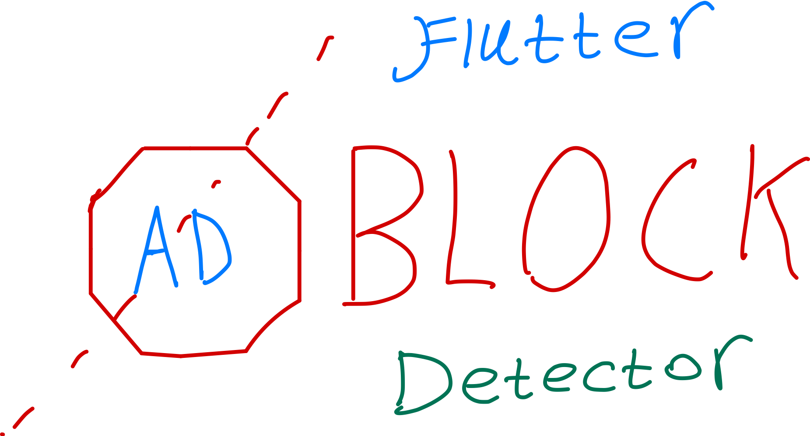

Cross Platform AdBlock Detector for Flutter. Detects if the user has an AdBlocker enabled.



## Features

- Check if a user has a DNS level AdBlocker enabled (PiHole, AdGuard DNS, uBlock, brave shields)
- Check if a user has AdGuard DNS enabled

## Warning

Please use this package responsibly!

## Usage

```dart
AdBlockDetector adBlockDetector = AdBlockDetector();

bool isAdblocking = await adBlockDetector
              .isAdBlockEnabled(testAdNetworks: [AdNetworks.googleAdMob]);
```
- Built In Ad Networks: AdNetworks.googleAdMob, AdNetworks.mediaNet, AdNetworks.appSumari, AdNetworks.startApp, AdNetworks.adColony
- Keep in mind some AdNetworks are blocked in some countries (like China). Google AdMob is not blocked in China

### Passing in Custom Ad Networks
```dart
AdBlockDetector adBlockDetector = AdBlockDetector();

bool isAdblocking = await adBlockDetector
              .isAdBlockEnabled(testAdNetworks: [], customAdNetworks[Uri.parse('https://a-test-url-for-the-adnetwork.com')]);
```

### Checking Network Connectivity
- By default, this package will attempt to send a get request to https://example.com to check if we have internet connection
- If no internet connection is detected, `isAdBlockEnabled()` will return false (this is to prevent false positives)

You can change the test URL as shown below. Keep in mind not all URLs are available everywhere (google.com is blocked in China)

```dart
AdBlockDetector adBlockDetector = AdBlockDetector(testHost: 'https://somewebsite.com/');

bool isAdblocking = await adBlockDetector
              .isAdBlockEnabled(testAdNetworks: [AdNetworks.googleAdMob]);
```
- Make sure it is a valid URL, and that the URL returns a 200 status code (not 404 page not found, otherwise that will be considered as the device being offline)


### Checking if a user is using AdGuard DNS
- AdGuard DNS is a popular way to do DNS level adblocking. If you would like to show instruction on how to disable it, or collect analytics for whatever reason you can do so like this:


```dart
AdBlockDetector adBlockDetector = AdBlockDetector();
bool isAdGuardDns = await adBlockDetector.isAdguardDNS();
```